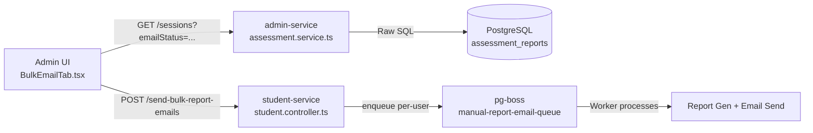

# Bulk Email Reporting — Module Documentation

> **Module:** Admin Panel — Bulk Email  
> **Scope:** Admin Service · Student Service · Frontend (Admin UI)  
> **Status:** Implemented ✅

---

## 1. Overview

The Bulk Email Reporting module allows administrators to **queue report generation and email dispatch for multiple candidates** in a single action. Instead of sending one-by-one, admins can filter, select, and bulk-queue jobs that are processed asynchronously by `pg-boss` background workers.

Key capabilities:
- Filter candidates by keyword, date range, and email dispatch status
- Select only `COMPLETED`-status sessions for dispatch
- Enqueue `pg-boss` jobs that generate PDF reports and email them
- Reflect real-time "Sent To" and "Email Status" data from the database

---

## 2. Architecture Overview



---

## 3. Backend

### 3.1 Admin Service — Assessment Sessions API

**File:** [backend/admin-service/src/assessment/assessment.service.ts](file:///d:/Folders/TouchMark/originbi/backend/admin-service/src/assessment/assessment.service.ts)  
**File:** [backend/admin-service/src/assessment/assessment.controller.ts](file:///d:/Folders/TouchMark/originbi/backend/admin-service/src/assessment/assessment.controller.ts)

#### Controller endpoint

```typescript
// GET /assessment/sessions
@Get('sessions')
findAllSessions(
  @Query('page') page: number,
  @Query('limit') limit: number,
  @Query('search') search: string,
  @Query('sortBy') sortBy: string,
  @Query('sortOrder') sortOrder: 'ASC' | 'DESC',
  @Query('type') type: string,
  @Query('start_date') startDate: string,
  @Query('end_date') endDate: string,
  @Query('emailStatus') emailStatus?: 'sent' | 'not_sent' | 'third_party',  // NEW
)
```

#### `emailStatus` filter logic (service layer)

The service applies a `LEFT JOIN` with `assessment_reports` when filtering by email status:

| Filter Value | Behavior |
|---|---|
| `sent` | `email_sent = true` AND `email_sent_to = user.email` |
| `third_party` | `email_sent = true` AND `email_sent_to != user.email` |
| `not_sent` | `email_sent IS NULL OR email_sent = false` |
| *(omitted)* | No filter applied |

#### Email metadata hydration (raw SQL)

After fetching the main session list, a **secondary raw SQL query** fetches email metadata. This replaces the previously broken `leftJoinAndMapOne` TypeORM approach which failed with raw table strings.

```sql
SELECT assessment_session_id, email_sent, email_sent_to, created_at
FROM assessment_reports
WHERE assessment_session_id = ANY($1)
```

The result is merged back into each session object as `emailSent` and `emailSentTo`.

---

### 3.2 Student Service — Bulk Enqueue API

**File:** [backend/student-service/src/student/student.controller.ts](file:///d:/Folders/TouchMark/originbi/backend/student-service/src/student/student.controller.ts)

#### Endpoint

```
POST /student/send-bulk-report-emails
```

#### Request Body

```typescript
{
  userIds: number[]   // Array of user IDs to queue report emails for
}
```

#### Response Body

```typescript
{
  enqueued: number,   // Count of successfully queued jobs
  failed: number[]    // userIds that failed to enqueue
}
```

#### Internal Logic

1. Receives `userIds[]`
2. Loops through each `userId`
3. Calls `PgBossService.send('manual-report-email-queue', { userId })` for each
4. Returns a summary with counts of enqueued and failed jobs

The `manual-report-email-queue` worker (already registered in `StudentProcessor.onModuleInit`) handles:
- Fetching the user's assessment data
- Generating the PDF report
- Sending the email with the report attached

---

## 4. Frontend

### 4.1 Service Layer

**File:** [frontend/lib/services/assessment.service.ts](file:///d:/Folders/TouchMark/originbi/frontend/lib/services/assessment.service.ts)

#### Updated [AssessmentSession](file:///d:/Folders/TouchMark/originbi/frontend/lib/services/assessment.service.ts#6-44) Interface

```typescript
interface AssessmentSession {
  // ... existing fields ...
  emailSent?: boolean;
  emailSentTo?: string | null;
}
```

#### Updated [getSessions()](file:///d:/Folders/TouchMark/originbi/frontend/lib/services/assessment.service.ts#46-93) method

Accepts an optional `emailStatus` filter in the `filters` parameter:

```typescript
getSessions(
  page: number,
  limit: number,
  search: string,
  sortBy: string,
  sortOrder: 'ASC' | 'DESC',
  filters?: {
    type?: string;
    start_date?: string;
    end_date?: string;
    emailStatus?: 'sent' | 'not_sent' | 'third_party';
  }
): Promise<{ data: AssessmentSession[]; total: number }>
```

#### New [sendBulkReportEmails()](file:///d:/Folders/TouchMark/originbi/frontend/lib/services/assessment.service.ts#94-108) method

```typescript
sendBulkReportEmails(userIds: number[]): Promise<{ enqueued: number; failed: number[] }>
```

Calls `POST /student/send-bulk-report-emails` via `NEXT_PUBLIC_STUDENT_API_URL`.

---

### 4.2 BulkEmailTab Component

**File:** [frontend/components/admin/BulkEmailTab.tsx](file:///d:/Folders/TouchMark/originbi/frontend/components/admin/BulkEmailTab.tsx)

#### Props Interface

```typescript
interface BulkEmailTabProps {
  onViewSession: (session: AssessmentSession) => void;
  page: number;                         // Controlled by parent
  entriesPerPage: number;               // Controlled by parent
  onTotalChange: (total: number) => void; // Reports total to parent for pagination bar
}
```

> **Note:** `page` and `entriesPerPage` are lifted to the parent ([RegistrationManagement](file:///d:/Folders/TouchMark/originbi/frontend/components/admin/RegistrationManagement.tsx#40-1036)) so pagination renders in the shared top tab bar — consistent with all other admin tabs.

#### Internal State

| State | Type | Purpose |
|---|---|---|
| `sessions` | `AssessmentSession[]` | Current page of results |
| `loading` | `boolean` | Loading spinner |
| `searchTerm` | `string` | Debounced text search |
| `emailStatusFilter` | `"all" \| "sent" \| "not_sent" \| "third_party"` | Email status filter dropdown |
| `dateRangeLabel` | `string` | Display label for selected date range |
| `startDate / endDate` | `Date \| null` | Actual date bounds for API |
| `selectedIds` | `Set<string>` | Set of currently checked session IDs |
| `sending` | `boolean` | Bulk send in-progress guard |
| `toast` | `{ type, msg } \| null` | Feedback notification |

#### Key Behaviors

- **Search debounce:** 400ms via a custom [useDebounce](file:///d:/Folders/TouchMark/originbi/frontend/components/admin/RegistrationManagement.tsx#30-39) hook.
- **Sorting:** Always `DESC` by `exam_starts_on` (most recent first). Custom date range preserves descending order.
- **Selection gating:** Only sessions with `status === "COMPLETED"` can be checked. Others render with `opacity-45` and `disabled` checkboxes.
- **Select All:** Header checkbox selects/deselects all `COMPLETED` sessions on the current page.
- **Optimistic UI:** After enqueue, `emailSent: true` and `emailSentTo: user.email` are set immediately in local state without waiting for a re-fetch.

#### Filter Row Layout

```
[Search Input ............. ] [ Date Range ▾ ] [ All Mail Status ▾ ]
```

Pagination is **not** in this row — it's in the parent's shared tab header bar.

#### Email Status Badge Logic

| `emailSent` | `emailSentTo` matches user email? | Badge | Sent To column |
|---|---|---|---|
| `false` / `null` | — | `Not Sent` (gray) | `-` |
| `true` | ✅ Yes | `Sent` (green) | user's email |
| `true` | ❌ No | `Sent (3rd party)` (amber) | third-party email |

---

### 4.3 RegistrationManagement — Container Integration

**File:** [frontend/components/admin/RegistrationManagement.tsx](file:///d:/Folders/TouchMark/originbi/frontend/components/admin/RegistrationManagement.tsx)

#### New State (for Send Emails tab pagination)

```typescript
const [sendEmailsPage, setSendEmailsPage] = useState(1);
const [sendEmailsEntriesPerPage, setSendEmailsEntriesPerPage] = useState(20);
const [sendEmailsTotal, setSendEmailsTotal] = useState(0);
const [showSendEmailsEntriesDropdown, setShowSendEmailsEntriesDropdown] = useState(false);
const sendEmailsEntriesRef = useRef<HTMLDivElement>(null);
```

#### Tab Discovery Flow

```
User is on "Individual Assessment" tab
→ Clicks "Send Emails" button (placed near "Excel Export" in toolbar)
→ setShowSendEmailsTab(true) + setActiveTab('send-emails')
→ The "Send Emails" tab appears in the tab bar with a close (×) button
→ Clicking × resets to individual tab and hides the Send Emails tab
```

#### Conditional UI Rules

| When `activeTab === 'send-emails'` |
|---|
| ✅ Show Send Emails tab button |
| ✅ Show Send Emails pagination in top-right (per-page + total + arrows) |
| ✅ Show [BulkEmailTab](file:///d:/Folders/TouchMark/originbi/frontend/components/admin/BulkEmailTab.tsx#66-465) in the content area |
| ❌ Hide parent search/filter/button row |
| ❌ Hide parent top compact pagination bar |
| ❌ Hide parent bottom numbered pagination bar |

#### BulkEmailTab Usage (in JSX)

```tsx
<BulkEmailTab
  page={sendEmailsPage}
  entriesPerPage={sendEmailsEntriesPerPage}
  onTotalChange={(total) => setSendEmailsTotal(total)}
  onViewSession={(session) => {
    setSelectedSession(session);
    setView('assessment-preview');
  }}
/>
```

---

## 5. Data Flow (End-to-End)

```
1. Admin opens /admin/registrations → Individual Assessment tab
2. Admin clicks "Send Emails" button
3. "Send Emails" tab becomes active (hidden tab revealed)
4. BulkEmailTab mounts → calls getSessions(page=1, limit=20, emailStatus=undefined)
5. admin-service SQL executes:
   a. Main query: assessment_sessions LEFT JOIN users, registrations, programs...
   b. Secondary raw SQL: SELECT email_sent, email_sent_to FROM assessment_reports WHERE ...
   c. Merged result returned to frontend
6. Admin applies filters (date, email status, search)
   → New getSessions() call with updated params
7. Admin selects rows (only COMPLETED) → selectedIds Set updates
8. Admin clicks "Send Emails (N)"
   → POST /student/send-bulk-report-emails { userIds: [...] }
   → pg-boss enqueues N jobs: manual-report-email-queue
9. Optimistic UI update: emailSent=true applied in local sessions state
10. pg-boss worker processes each job asynchronously:
    - Generates PDF report
    - Sends email
    - Updates assessment_reports.email_sent = true
```

---

## 6. Files Changed

| File | Change Type | Summary |
|---|---|---|
| `admin-service/assessment.controller.ts` | Modified | Added `emailStatus` query param |
| `admin-service/assessment.service.ts` | Modified | Added emailStatus filter + raw SQL email data hydration |
| `student-service/student.controller.ts` | Modified | Added `POST /send-bulk-report-emails` endpoint |
| [frontend/lib/services/assessment.service.ts](file:///d:/Folders/TouchMark/originbi/frontend/lib/services/assessment.service.ts) | Modified | Updated [AssessmentSession](file:///d:/Folders/TouchMark/originbi/frontend/lib/services/assessment.service.ts#6-44) interface; added [getSessions](file:///d:/Folders/TouchMark/originbi/frontend/lib/services/assessment.service.ts#46-93) filter + [sendBulkReportEmails](file:///d:/Folders/TouchMark/originbi/frontend/lib/services/assessment.service.ts#94-108) |
| [frontend/components/admin/BulkEmailTab.tsx](file:///d:/Folders/TouchMark/originbi/frontend/components/admin/BulkEmailTab.tsx) | New | Bulk email tab UI component |
| [frontend/components/admin/RegistrationManagement.tsx](file:///d:/Folders/TouchMark/originbi/frontend/components/admin/RegistrationManagement.tsx) | Modified | Tab integration, pagination lift, conditional UI guards |

---

## 7. Environment Variables Required

| Variable | Used In | Purpose |
|---|---|---|
| `NEXT_PUBLIC_STUDENT_API_URL` | [assessment.service.ts](file:///d:/Folders/TouchMark/originbi/frontend/lib/services/assessment.service.ts) | Base URL for the student-service API calls |

---

## 8. Known Design Decisions

- **Raw SQL over TypeORM join** for email metadata: TypeORM's `leftJoinAndMapOne` does not work when the join target is a raw table string reference (not an entity relation). The raw secondary query is more explicit and easier to debug.
- **Pagination lifted to parent:** The admin panel's top tab bar has a fixed slot for per-page selector + arrows. To match this across all tabs, send-emails pagination lives in the parent rather than inside [BulkEmailTab](file:///d:/Folders/TouchMark/originbi/frontend/components/admin/BulkEmailTab.tsx#66-465).
- **Optimistic updates:** The frontend reflects sent status immediately after enqueue rather than waiting for the background worker. This is acceptable because the intent was successfully registered even if the email is still processing.
- **pg-boss vs direct send:** Bulk email is deliberately asynchronous. Large volumes of recipients would time out a synchronous HTTP response, so each user gets its own job in the queue.
